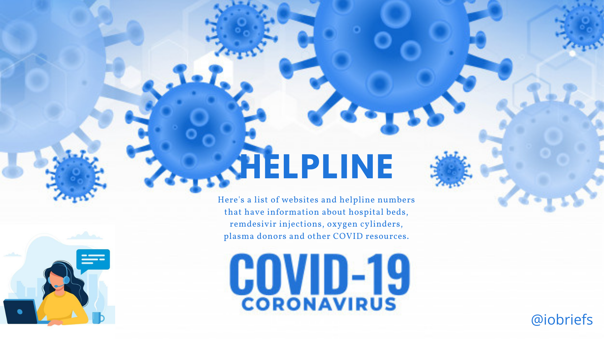

# Covid-19-Information on hospital beds, oxygen, plasma and Remdesivir Injection

Here's a list of websites and helpline numbers that have information about hospital beds, remdesivir injections, oxygen cylinders, plasma donors and other COVID resources.

- *source*- [india.com](https://www.india.com/news/india/covid19-coronavirus-resources-list-of-websites-helpline-numbers-hospital-beds-remdesivir-injections-plasma-donor-oxygen-4590711/) and Social Media.

With the second wave of coronavirus in India and sudden spike in daily infections, the demand for remdesivir injections, hospital beds, oxygen cylinders and plasma donors has increased massively once again. Remdesivir, an antiviral drug used in the treatment of COVID-19, is manufactured by a handful of companies under brand names like Cipremi (Cipla), Covifar (Hetero), Desrem (Mylon), Remdac (Zydus), Redyx (Dr. Reddy’s).

On Friday, State and the Central government said is taking all steps to accelerate the production of remdesivir injections and ensure its availability in the country.

It is being reported recently that remdesivir injections are being sold on the black market due to the high demand. Enforcement authorities of states and central government have been directed by Drugs Controller General of India (DCGI) to take immediate action on incidence of black-marketing, hoarding and overcharging of remdesivir.

Just like last year, several states which have been badly hit due to the pandemic are reporting a shortage of beds for COVID-19 patients. Meanwhile, the state governments have also amped up its hospital bed capacity by declaring specific big hospitals as dedicated COVID centres, adding more beds and by opening makeshift COVID facilities.
To help people who are finding it difficult to get a hospital bed or any other COVID-19 patient facing a difficulty, social media platforms are being flooded with information about resources.

#### Procedures for Self-Quarantine under Covid-19

###### Here’s a list of websites and helpline numbers that have information about hospital beds, remdesivir, etc.

- Dr Reddys has launched a website to track the availability of Remdesivir injection in real-time. Dr. Reddys website – Readytofightcovid.in and helpline number – 1800-266-708
- Cipla is currently giving remedesivir injections directly to the hospital where a patient has been admitted in order to avoid the black marketing of the medicines. Cipla websites – www.cipla.com , email at –  info.availability@cipla.com, helpline no. – 8657311088
- Delhi's government’s website to keep track of beds – https://delhifightscorona.in/
- Blog of consolidated information on empty hospital beds, oxygen cylinders, information on plasma etc. – https://blog.indianhelpline.com/2021/04/15/india-fights-covid/
- https://coronabeds.jantasamvad.org/beds.html
- Hetero – website www.heterohealthcare.com , helpline no. – 04040473535
- Website specifically for Bengaluru with information about COVID-19 resources –https://covidhelplinebangalore.com/
- Website specifically for Ranchi with information about COVID-19 resources – https://localsay.in/beds —
- For patients with mild systems, some hospitals are giving nursing facilities and online appointments with doctors – email at appointment@nanvatihospital.org .  This website is specific to Mumbai – https://www.nanavatihospital.org/
- Website specifically for West Bengal with information about COVID-19 resources - https://app.peoplecarenetwork.org/

###### Here’s a list of websites that have information on how and where plasma can be donated to users:

Some platforms also connect doctors to plasma donors and those in need of plasma.

- You can find consolidated resources for plasma at – covidplasma.online/
- https://dhoondh.com
- http://needplasma.in/

###### Instagram, Telegram and Twitter pages working towards consolidating information on resources:

- @pandemicrelieflistindia on Instagram
- https://t.me/fightagainstcovid19 (Telegram channel)
- https://twitter.com/switchindiaorg (Twitter handle)
- https://twitter.com/112UttarPradesh (Twitter handle)

###### West Bengal Government control room number for oxygen amd Remdesivir.

- Remdesivir - 7596056441, 7596056442, 7596056445
- Oxygen - 7596056443, 7596056444

###### Rapid Covid-19 test in kolkata,west Bengal.

"Stay safe and stay healthy" - Tamojit Das
