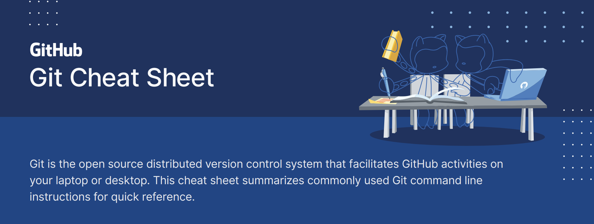

### Install

###### GitHub Desktop
[desktop.github.com]()

###### Git for All Platforms
[git-scm.com]()

### Configure tooling
Configure user information for all local repositories
```shell
git config --global user.name "[name]"
```
Sets the name you want attached to your commit transactions
```shell
git config --global user.email "[email address]"
```
Sets the email you want attached to your commit transactions
```shell
git config --global color.ui auto
```
Enables helpful colorization of command line output

### Branches
Branches are an important part of working with Git. Any commits you make will be made on the branch you’re currently “checked out” to. Use ```git status``` to see which branch that is.
```shell
git branch [branch-name]
```
Creates a new branch
```shell
git checkout [branch-name]
```
Switches to the specified branch and updates the working directory
```shell
git merge [branch]
```
Combines the specified branch’s history into the current branch. This is usually done in pull requests, but is an important Git operation.
```shell
git branch -d [branch-name]
```
Deletes the specified branch

### Create repositories
A new repository can either be created locally, or an existing repository can be cloned. When a repository was initialized locally, you have to push it to GitHub afterwards.
```shell
git init
```
The ```git init``` command turns an existing directory into a new Git repository inside the folder you are running this command. After using the ```git init``` command, link the local repository to an empty GitHub repository using the following command:
```shell
git remote add origin [url]
```
Specifies the remote repository for your local repository. The url points to a repository on GitHub.
```shell
git clone [url]
```
Clone (download) a repository that already exists on GitHub, including all of the files, branches, and commits

### The .gitignore file
Sometimes it may be a good idea to exclude files from being tracked with Git. This is typically done in a special file named ```.gitignore```. You can find helpful templates for ```.gitignore``` files at github.com/github/gitignore.

### Synchronize changes
Synchronize your local repository with the remote repository on GitHub.com
```shell
git fetch
```
Downloads all history from the remote tracking branches
```shell
git merge
```
Combines remote tracking branches into current local branch
```shell
git push
```
Uploads all local branch commits to GitHub
```shell
git pull
```
Updates your current local working branch with all new commits from the corresponding remote branch on GitHub. ```git pull``` is a combination of ```git fetch``` and ```git merge```

### Make changes
Browse and inspect the evolution of project files
```shell
git log
```
Lists version history for the current branch
```shell
git log --follow [file]
```
Lists version history for a file, beyond renames (works only for a single file)
```shell
git diff [first-branch]...[second-branch]
```
Shows content differences between two branches
```shell
git show [commit]
```
Outputs metadata and content changes of the specified commit
```shell
git add [file]
```
Snapshots the file in preparation for versioning
```shell
git commit -m "[descriptive message]"
```
Records file snapshots permanently in version history

### Redo commits
Erase mistakes and craft replacement history
```shell
git reset [commit]
```
Undoes all commits after [commit], preserving changes locally
```shell
git reset --hard [commit]
```
Discards all history and changes back to the specified commit

```⚠️CAUTION! Changing history can have nasty side effects. If you need to change commits that exist on GitHub (the remote), proceed with caution. If you need help, reach out at [github.community]() or contact support.```

### Glossary
- **git**: an open source, distributed version-control system
- **GitHub**: a platform for hosting and collaborating on Git repositories
- **commit**: a Git object, a snapshot of your entire repository compressed into a SHA
- **branch**: a lightweight movable pointer to a commit
- **clone**: a local version of a repository, including all commits and branches
- **remote**: a common repository on GitHub that all team members use to exchange their changes
- **fork**: a copy of a repository on GitHub owned by a different user
- **pull request**: a place to compare and discuss the differences introduced on a branch with reviews, comments, integrated tests, and more
- **HEAD**: representing your current working directory, the HEAD pointer can be moved to different branches, tags, or commits when using git checkout
