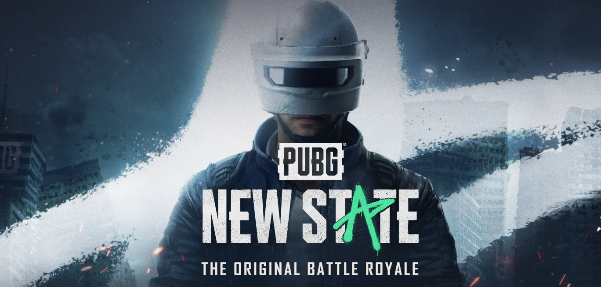
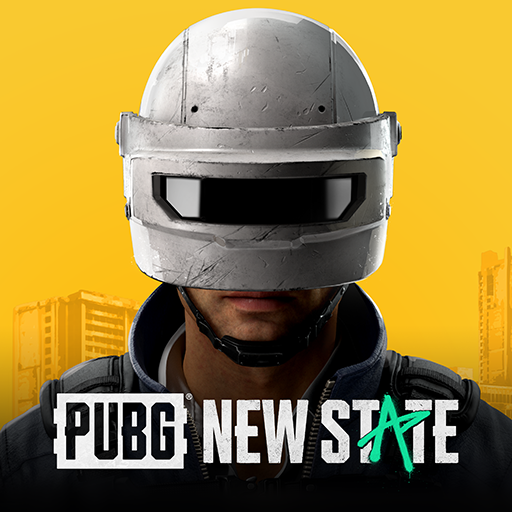
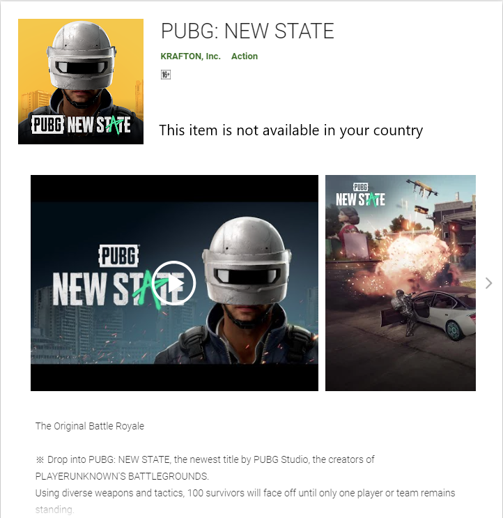

Here is everything we know about the PUBG Mobile sequel.
##### HIGHLIGHTS

- PUBG Mobile successor is called PUBG: New State.
- PUBG New State trailer tells us about some new gameplay mechanics, maps, and improved graphics.
- PUBG New State isn’t available for download in India just yet.

PUBG New State release has been officially announced by PUBG Studio and Krafton. The new battle royale game is the successor to the extremely popular PUBG Mobile and will be available for Android and iOS users. We reported earlier that a PUBG Mobile sequel was in the works and that it would arrive next week. It turns out that Krafton had a surprise in store for us and dropped the PUBG: New State pre-registration trailer this week. Outside of the trailer, little more is known about what PUBG New State has in store for us. Here’s everything we know about the all-new PUBG Mobile sequel.

##### PUBG : NEW STATE TRAILER
<iframe width="100%" height="500" src="https://www.youtube.com/embed/v-7XAgT1Z1w" frameBorder="0" allow="accelerometer; autoplay; clipboard-write; encrypted-media; gyroscope; picture-in-picture"
        allowFullScreen/>

The PUBG New State trailer confirms some speculation we made about the title. For starters, the game is set in the future (2051, to be precise). There’s a new map too, set in a dystopian setting. PUBG New State’s official Google Play Store listing says that is 8×8 in size. Several new vehicles have been introduced, including an ATV (all-terrain vehicle). The selection of guns is more or less the same, but we can expect the developers to add new ones as time passes. New gameplay mechanics include acquiring supplies via a drone and an expandable shield that can be deployed to block enemy fire. As expected, the graphics are significantly better than that of the original PUBG Mobile. This is all we know about PUBG New State gameplay at the moment.

##### PUBG New State pre-registration link

Although PUBG New State has a [Google Play Store listing](https://play.google.com/store/apps/details?id=com.pubg.newstate), there appears to be no option to pre-register in India. PUBG New State pre-order link on the Apple App Store is yet to go live. Those outside India who are able to pre-order the game will receive exclusive benefits such as a limited vehicle skin. Krafton could solicit community help to beta test the game sometime in the future. It is common for developers to beta test a game rigorously before a public release.

##### Is PUBG New State free?

A massive part of the original PUBG Mobile’s success could be attributed to its free-to-play model. Unlike other mobile games’ blatantly play to win mechanics, PUBG Mobile levelled the playing field by offering cosmetic-only microtransactions. PUBG: New State’s Google Play Store page says that it will have in-game microtransactions, but the game should be free to download much like PUBG Mobile.

##### Will PUBG New State run on my phone?

PUBG New State requires devices running Android 6.0 or higher and at least 2.5GB of RAM. There is no mention of SoC requirements just yet, but those should be revealed soon. Looking at the visual fidelity that PUBG New State has to offer, it has the potential to push even the beefiest gaming smartphone to its limits. Krafton is pretty adept at optimizing its games for older/entry-level smartphones, but the experience might not be optimal. As it stands now, PUBG: New State should run properly on most modern-day smartphones, but we can’t promise the same on some older devices.

##### Is PUBG New State available in India?

Due to the PUBG Mobile ban in India, it seems it will be a while before PUBG New State releases in the country. To recall, Krafton announced PUBG Mobile India game that is yet to get the green light for launch. Since there is no word yet on the PUBG Mobile India launch, it’s unclear when PUBG New State will arrive even though China-based Tencent is no longer the publisher. The Google Play Store listing is bereft of any option to pre-register for the game, but that option should pop up soon if things change in favour of Krafton. Keep an eye out on the official [PUBG New State website](https://newstate.pubg.com/index.html#) to find out about new developments.