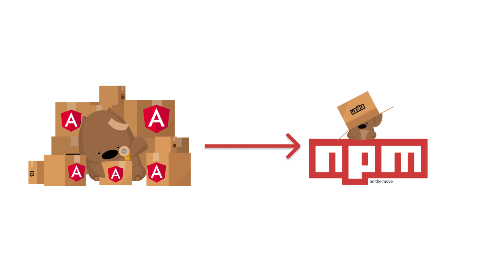

In this post we'll go through the steps to create and publish an Angular component to the npm package registry.

### Sign up to npm
The first thing you need to publish an Angular component to npm is a npm account, you can [sign up](https://www.npmjs.com/signup) here for free.

### Install Node & npm
If you're ready to publish a package to npm you probably already have NodeJS and npm installed, but if not you can install them from https://nodejs.org/en/download/.

### Install the Angular CLI
Install the Angular CLI globally with command `npm i -g @angular/cli`

The Angular CLI is the de facto command line tool used to develop, build and test Angular applications. For more info see https://cli.angular.io.

### Create a new workspace for your Angular component project
Angular projects are developed within workspaces, so before creating a project you must create a workspace that it will belong to.

Create a new Angular workspace with the command
```shell
ng new <workspace-name> --create-application=false
```

Then navigate into the workspace folder with the command `cd <workspace-name>`

The `--create-application=false` flag prevents a default Angular application project from being created, because you'll be creating a library project for your component.
The workspace name can be the same as the component project name e.g.
```shell
ng new my-cool-angular-component --create-application=false
```

### Create a new Angular library project

Angular library projects are used for developing reusable components and services that can be published as npm packages. They are a special type of project that can't be run on their own and can only be imported and used within other Angular applications.

Create a new library project for your component with the command
```shell
ng generate library <project-name>
```
(from inside the workspace folder)

```
NOTE: check the name of your project or package in npm before creating, if the same name exists it won't work
```

This will generate a project in your workspace that contains an Angular module with a component and a service.

It's a good idea to check if the package name is already taken on https://www.npmjs.com so you don't have to change it before publishing. Package names must be unique in the npm registry and anyone can publish a package, so it's first in best dressed.

### Remove unused files from project
The generated Angular library project comes with a component and a service, so if you only need a component you can delete the service and associated files with the following steps:

- Delete the service file `projects/<project-name>/src/lib/<project-name>.service.ts`.
- Delete the service test file `projects/<project-name>/src/lib/<project-name>.service.spec.ts`.
- Update the public api file `projects/<project-name>/src/public-api.ts` to remove the reference to the deleted service file.

### Update the Angular component with your code
Replace the generated Angular component with the custom component that you want to publish to npm.

This is an example code, you make your own package with your code you want.

`task-form.component.ts`

```ts
import { Component, OnInit } from '@angular/core';
import { FormControl, FormGroup, Validators } from '@angular/forms';
import { Router } from '@angular/router';
import { BsModalRef} from 'ngx-bootstrap/modal';
import { Task } from '../models/Task';
import { TaskManagerService } from '../services/taskmanager.service';

@Component({
  selector: 'app-task-form',
  templateUrl: './task-form.component.html',
  styleUrls: ['./task-form.component.css']
})
export class TaskFormComponent implements OnInit {

  constructor(public modalRef: BsModalRef,
              private managerService:TaskManagerService,
              private router : Router) { }

  //Validation
  taskForm = new FormGroup({
    title:new FormControl('',[Validators.required]),
    desciption : new FormControl('',[Validators.required]),
    category : new FormControl ('',[Validators.required]),
    imageUrl : new FormControl ('',[Validators.required]),
    dueDate : new FormControl ('',[Validators.required]),
    priorityLevel : new FormControl ('',[Validators.required])

  })

  id?:number;
  get title() { return this.taskForm.get('title'); }
  get desciption() { return this.taskForm.get('desciption'); }
  get category() { return this.taskForm.get('category'); }
  get imageUrl() { return this.taskForm.get('imageUrl'); }
  get dueDate() { return this.taskForm.get('dueDate'); }
  get priorityLevel() { return this.taskForm.get('priorityLevel'); }

  //get loggedIn UserID and Task Id
  currentUserID!: number;
  latestTaskID!: number;

  minDate:any = ""

  ngOnInit(): void
  {
    //get loggedIn UserID
      let userID:string|null = localStorage.getItem('currentUserID')
      this.currentUserID = parseInt(userID == null ? '' : userID)

    //Get Latest Task Id
    this.managerService.getLatestTaskID(this.currentUserID).subscribe(response => {
      this.latestTaskID = response
      console.log(this.latestTaskID)
      this.id = this.latestTaskID + 1
    })

    this.getDate();
  }

  // Form Submit
  addTask()
  {
    if(this.taskForm.value.title == '' && this.taskForm.value.desciption == '' && this.taskForm.value.category == '' && this.taskForm.value.imageUrl == '' && this.taskForm.value.dueDate == '')
    {
      alert("Enter Mandatory Fields!")
    }
    else{
      let newTask:Task =  new Task (
          this.id!,
          this.taskForm.value.title,
          this.taskForm.value.desciption,
          this.taskForm.value.dueDate,
          this.taskForm.value.priorityLevel,
          this.taskForm.value.category,
          this.taskForm.value.imageUrl)
          console.log(newTask)

      this.managerService.addNewTask(this.currentUserID, newTask)
      .subscribe(response => {
        console.log(response)
        this.closeModel()
        this.router.navigateByUrl('/cards')
      })
    }

  }

  getDate(){
    const date: any = new Date();
    let toDate: any = date.getDate();
    if(toDate<10){
      toDate= "0" + toDate;
    }
    let month: any = date.getMonth() + 1;
    if(month<10){
      month= "0" + month;
    }
    const year = date.getFullYear();
    this.minDate=year + "-" + month + "-" + toDate;
    console.log(this.minDate)
  }


// Close Model
  closeModel(){
    this.modalRef.hide()
  }

}
```

`task-form.component.html`

```html
<div class="modal-content text-color" id="taskModel"  role="dialog" aria-labelledby="taskModelForm" aria-hidden="true">
    <div class="modal-header">
        <h6 class="">Add New Task</h6>
        <button type="button" class="close" aria-label="Close" (click)=closeModel() data-dismiss="#modal-content">
            <span aria-hidden="true">&times;</span>
        </button>
    </div>

    <div class="modal-body">
        <form name="taskForm" [formGroup]="taskForm" (ngSubmit)="addTask()">
            <div class="row">
                <div class="col-12">
                    <div class=" form-outline">
                        <label for="title" >Task Title </label>
                        <input type="text" name="title" id="title"  class="form-control"  formControlName="title"/>
                    </div>
                        <mdb-error *ngIf="title && title.invalid && (title.dirty || title.touched)" class="text-danger ml-4 mt-6">Title is Required</mdb-error>
                </div>
            </div>
            <br>
            <div class="row">
                <div class="col-12">
                    <div class="form-group">
                        <label for="desciption" >Task Description </label>
                        <textarea type="text" name="desciption" id="desciption" class="form-control" formControlName="desciption" rows="3"></textarea>
                            <mdb-error *ngIf="desciption && desciption.invalid && (desciption.dirty || desciption.touched)" class="text-danger mx-4">Write some content about your task</mdb-error>
                    </div>
                </div>
            </div>

            <div class="row">
                <div class="col-12">
                    <div class="form-group">
                        <label for="category" >Category </label>
                        <input type="text" name="category" id="category" formControlName="category" class="form-control" >
                        <mdb-error *ngIf="category && category.invalid && (category.dirty || category.touched)" class="text-danger mx-4">Category should not be empty</mdb-error>
                    </div>
                </div>
            </div>

            <div class="row">
                <div class="col-lg-5">
                    <div class="form-outline">
                        <label for="dueDate" >Date </label>
                        <input type="date" name="dueDate" id="dueDate" formControlName="dueDate" class="form-control" min="{{minDate}}">
                         <mdb-error *ngIf="dueDate && dueDate.invalid && (dueDate.dirty || dueDate.touched)" class="text-danger mx-4">Due date should not be empty</mdb-error>
                    </div>
                </div>

                <div class="col-lg-7">
                    <div class="form-group">
                        <p>Priority</p>
                        <div class="form-check form-check-inline">
                            <label for="high">
                            <input id="high" type="radio" class="form-check-control" formControlName="priorityLevel" value="HIGH" name="priorityLevel">
                            High</label>
                        </div >
                        <div class="form-check form-check-inline">
                            <label for="medium" >
                            <input id="medium" type="radio" class="form-check-control" formControlName="priorityLevel" value="MEDIUM" name="priorityLevel">
                            Medium</label>
                        </div>
                        <div class="form-check form-check-inline">
                            <label for="low">
                            <input id="low" type="radio" class="form-check-control" formControlName="priorityLevel" value="LOW" name="priorityLevel">
                            Low</label>
                        </div>
                    </div>
                </div>
            </div>

            <div class="modal-footer">
                <input class="btn btn-primary" type="submit" value="Save" />
              </div>

        </form>
    </div>
</div>
```

### Build your Angular component

Run the command `ng build <project-name> --prod` from your workspace folder to build your component, the output files are created in the `dist/<project-name>` folder.

The `--prod` flag tells the Angular CLI to build the component with the old Angular compiler + runtime to make it compatible with previous versions of Angular (before 9). The new compiler + runtime is called Ivy and the old compiler + runtime is called *View Engine*.

### Login to the npm registry with the npm cli

Run `npm login` from the command line and enter the credentials that you used to sign up to npmjs.com in the first step.

### Publish your Angular component to npm!

Navigate to the project dist folder with the command `cd dist/<project-name>`

Run the command `npm publish` to publish the component the npm.

Now go and check out your new Angular component on the npm website at `https://www.npmjs.com/package/<project-name>`. You can also run `npm info <project-name>` from the command line to see all the metadata info about your package that's stored on the npm registry.

```
NOTE: To update your package in npm you just need to increment the version number in the package.json file and run *npm publish* again.
```
