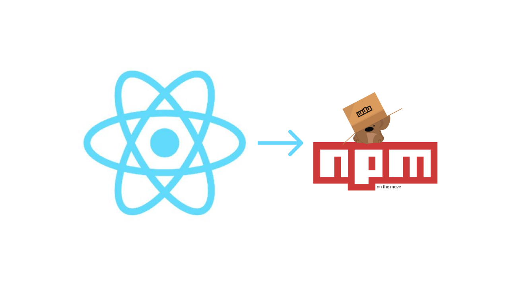

I recently went through the process of publishing a couple of simple React components to npm, so I thought I'd share the steps with other devs that are trying to do the same.

The React boilerplate project code used in the post is available on GitHub at https://github.com/cornflourblue/jw-react-npm-boilerplate and the associated npm package is published at https://www.npmjs.com/package/jw-react-npm-boilerplate.

### Sign Up to npm

The first thing you need to publish a React component to npm is a npm account, you can [sign up](https://www.npmjs.com/signup) here for free.

### Install Node & the npm cli

If you're at the point where you want to publish a package to npm I'm guessing you probably already have NodeJS and npm installed on your dev machine, if not you can install them from https://nodejs.org/en/download/.

### Setup your project folder

Create a folder for your React component code and project files, it's probably a good idea to check now if the package name is already taken on https://www.npmjs.com, so you don't have to change it before publishing. Package names must be unique in the npm registry and anyone can publish a package, so it's first in best dressed.

### Create a package.json file

You can use the one below that I prepared earlier, it already contains all the package dependencies required to build your React component using webpack.

You just need to update the following fields:

- **name** - set this to the name of your package as it will appear on npm, it should be the same name as your project folder
- **description** - a brief description of your package, this is optional so feel free to delete it if you prefer
- **main** - this points to the main entrypoint file for your React component, it matches the output filename created by webpack after it transpiles your ES6/JSX component into ES5 which is more widely supported by browsers

```json
{
    "name": "jw-react-npm-boilerplate",
    "version": "1.0.0",
    "description": "React Boilerplate Component for npm",
    "main": "./lib/BoilerplateComponent.js",
    "license": "MIT",
    "scripts": {
        "build": "webpack"
    },
    "peerDependencies": {
        "prop-types": "^15.6.0",
        "react": "^16.0.0",
        "react-dom": "^16.0.0"
    },
    "devDependencies": {
        "babel-core": "^6.21.0",
        "babel-loader": "^7.1.4",
        "babel-preset-env": "^1.6.1",
        "babel-preset-react": "^6.16.0",
        "babel-preset-stage-0": "^6.24.1",
        "path": "^0.12.7",
        "prop-types": "^15.6.0",
        "react": "^16.0.0",
        "react-dom": "^16.0.0",
        "webpack": "^4.5.0",
        "webpack-cli": "^3.2.1"
    }
}
```

### Create a webpack.config.js file

Copy this file into your project folder and update the following properties:

- **entry** - change 'BoilerplateComponent.jsx' to the name of your main React component JSX file
- **output > filename** - change 'BoilerplateComponent.js' to the name of the transpiled ES5 version of your React component that is generated by webpack, this must match the "main" property in the package.json file above

**IMPORTANT**: Make sure you set output > libraryTarget to 'commonjs2'. This sets the "module.exports" property in the output file to your React component which is required for it to be used as a npm package.

```js
var path = require('path');

module.exports = {
    mode: 'production',
    entry: './src/BoilerplateComponent.jsx',
    output: {
        path: path.resolve('lib'),
        filename: 'BoilerplateComponent.js',
        libraryTarget: 'commonjs2'
    },
    module: {
        rules: [
            {
                test: /\.jsx?$/,
                exclude: /(node_modules)/,
                use: 'babel-loader'
            }
        ]
    }
}
```

### Create a .babelrc file

Copy this file into your project folder as is, it configures the presets used by Babel to transpile (compile) your React component from ES6/JSX into ES5.

Babel is the javascript compiler that does the actual work of converting your React component into ES5, webpack is configured to use the 'babel-loader' for '*.jsx' files in the 'module > rules' section of the webpack.config.js file above.

```json
{
    "presets": [
        "react",
        "env",
        "stage-0"
    ]
}
```

### Create an .npmignore file

Copy this file into your project folder, it tells the npm cli which files to exclude from publishing into the npm package repository, it helps to keep your package lean by only including the files needed to run your React component in production.

```ignorelang
src
demo
.babelrc
webpack.config.js
```

### Create a React Component

For the purpose of this guide I've created the below boilerplate React component, but if you have your own React component ready you should be able to use it instead.

I decided to make the boilerplate React component a bit more realistic than a simple 'hello world', it contains a label and an input text box, and includes data coming into the component through props and going back out of the component through a callback function. While it doesn't do much, it contains the basic structure that I would use to build a real world React component for npm.

It has a 'label' string property for setting the label text, an 'onChange' callback function that passes the current value of the text box, and a 'styles' property for customising the styles of the label and text box elements. A couple of the props are required and one is optional.

The structure and ordering of the React component code follow the best practice recommendations from the Airbnb React/JSX Style Guide, I recommend referring to it if you get stuck thinking about how to structure your React components.


### React Boilerplate Component

```jsx
import React from 'react';
import PropTypes from 'prop-types';

const propTypes = {
    label: PropTypes.string.isRequired,
    onChange: PropTypes.func.isRequired,
    styles: PropTypes.object
}

const defaultProps = {
    styles: {
        label: {
            fontFamily: 'Comic Sans MS',
            color: 'green'
        },
        input: {
            background: '#ddd',
            border: '1px solid red'
        }
    }
}

class BoilerplateComponent extends React.Component {
    constructor(props) {
        super(props);
        this.handleChange = this.handleChange.bind(this);
    }

    handleChange(e) {
        this.props.onChange(e.target.value);
    }

    render() {
        const styles = this.props.styles || {};

        return (
            <div>
                <label style={styles.label}>{this.props.label}</label>
                <input type="text" style={styles.input} onChange={this.handleChange} />
            </div>
        );
    }
}

BoilerplateComponent.propTypes = propTypes;
BoilerplateComponent.defaultProps = defaultProps;

export default BoilerplateComponent;
```

### Build your React Component

Run `npm install` from the command line inside your project folder, this installs all the package dependencies for the project.

Run `npm run build` from the command line inside your project folder, this will run webpack via the **"scripts > build"** script in the package.json file above, when it's finished you should see the compiled ES5 version of your React component in the lib folder inside your project folder.

### Login to the npm registry with the npm cli

Run `npm login` from the command line and enter the credentials that you used to sign up to npmjs.com in the first step.

### Publish your React component to npm!

Run `npm publish` from the command line inside your project folder.

Now go and check out your new React component on the npm website at [https://www.npmjs.com/package/YOUR PACKAGE NAME](). You can also run `npm info [YOUR PACKAGE NAME]` from the command line to see all the metadata info about your package that's stored on the npm registry.

**NOTE**: To update your package in npm you just need to increment the version number in the `package.json` file and run `npm publish` again.

**NOTE**: check the name of your project or package in npm before creating, if the same name exists it won't work.

